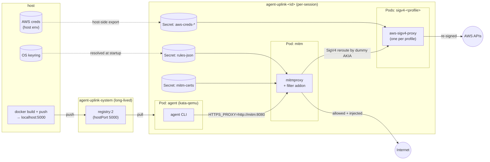

# agent-uplink

Run a coding agent in a Kata-containers microVM on a local k3s cluster with no direct network access. All outbound traffic is routed through a mitmproxy pod that enforces an allow-list and can inject credentials from your OS keyring, so secrets never enter the agent pod.

Agent-agnostic by design: the orchestration (mitmproxy, AWS SigV4 sidecars, K8s manifest assembly, NetworkPolicy perimeter, session cleanup) is generic, and each agent (currently just Claude) is a small subclass that owns its image, auth flow, and volume layout. Add a new agent by dropping a directory under `agent_uplink/agents/<name>/` — see [Adding an agent](#adding-an-agent).

AWS requests get the same treatment via SigV4 re-signing: the pod holds only dummy AWS credentials, and mitmproxy reroutes signed AWS requests to an `aws-sigv4-proxy` pod (one per profile) that re-signs with the real keys kept in a K8s Secret. See [AWS profiles](#aws-profiles).

**Linux only.** Tested against k3s. The design depends on Linux paths (`/home/<user>/...`) and assumes a single-node cluster where the host can `docker push` to the in-cluster registry. WSL2 works.

## Architecture



The agent pod's only egress path is enforced by `NetworkPolicy`: TCP to `mitm:8080` and UDP/TCP to `kube-dns`. Kata's microVM boundary is defence in depth on top.

## Install

```bash
pip install -e .
```

Requires `kubectl`, `docker`, and Python 3.10+ on `PATH`. `aws` CLI is needed only for `--aws-profiles`. Run from inside your home directory.

You also need a k3s (or compatible) cluster reachable via `kubectl`, with the `kata-qemu` RuntimeClass installed (`kubectl get runtimeclass kata-qemu`).

### One-time k3s setup for the local registry

On first run `agent-uplink` will tell you to set this up. The summary:

```bash
sudo mkdir -p /etc/rancher/k3s
sudo tee /etc/rancher/k3s/registries.yaml > /dev/null <<'EOF'
mirrors:
  "localhost:5000":
    endpoint:
      - "http://localhost:5000"
configs:
  "localhost:5000":
    tls:
      insecure_skip_verify: true
EOF
sudo systemctl restart k3s
```

This tells containerd to treat `localhost:5000` as an insecure (HTTP) registry. The registry itself is deployed automatically by `agent-uplink` as a hostNetwork pod in the `agent-uplink-system` namespace, listening on port 5000.

## Usage

`agent-uplink` takes a subcommand per agent. Today the only agent is `claude`; for it, one of `--anthropic` or `--bedrock` is required — it picks the provider env var injected into the pod and the auth rule layered on top of the defaults.

```bash
agent-uplink claude --anthropic                                       # Anthropic API
agent-uplink claude --bedrock                                         # AWS Bedrock (bearer token)
agent-uplink claude --anthropic --rules examples/rules/atlassian.yaml # add rules on top of defaults
agent-uplink claude --anthropic --rules my.yaml --no-default-rules    # use only your rules (you must supply auth)
agent-uplink claude --bedrock --aws-profiles profile1 profile2        # also inject AWS credentials
agent-uplink claude --anthropic --force-rebuild                       # rebuild the agent image
```

Common flags (apply to any agent): `--aws-profiles`, `--mitmproxy-image`, `--sigv4-proxy-image`, `--registry-image`, `--agent-runtime-class`, `--mitm-runtime-class`, `--sigv4-runtime-class`, `--force-rebuild`, `--rules`, `--no-default-rules`, `--debug`.

Per-agent flags for `claude`: `--image`, `--anthropic`/`--bedrock`.

State lives under `~/.agent_uplink/`; each run gets a session directory **and** a per-session K8s namespace `agent-uplink-<id>`, both cleaned up on exit.

### Required secrets per claude mode

| Mode | Source | Populate with |
| --- | --- | --- |
| `--anthropic` | `~/.claude/.credentials.json` | `claude login` (the file's OAuth token is read on the host; the pod only sees a fake placeholder) |
| `--bedrock` | service `bedrock`, user `key` in the host keyring | `keyring set bedrock key` (paste the value of `AWS_BEARER_TOKEN_BEDROCK`) |

Anthropic mode refreshes `~/.claude/.credentials.json` on the host when the OAuth token is near expiry, so runs survive across token rotations.

`--no-default-rules` skips the agent's auth rule too — for `--bedrock` you must supply your own in `--rules`. (`--anthropic` always wires up the OAuth-backed rule from the host's credentials file.)

## Runtime classes

Only the agent pod runs in a microVM by default; the support pods (mitm, sigv4) use the cluster default runtime under a hardened security context. Trade speed against isolation per component:

```bash
--agent-runtime-class kata-qemu   # default; flip to kata-fc or '' to disable
--mitm-runtime-class ''           # default '' = cluster default (e.g. crun)
--sigv4-runtime-class ''          # default '' = cluster default
```

Pushing `--mitm-runtime-class kata-qemu` adds ~10s of cold-start latency but isolates the mitm pod inside its own VM too. Worth it if you don't trust the mitm image or addon.

## Rules

Rules are YAML, evaluated in order; first match wins. Your rules are appended to the layered defaults unless `--no-default-rules` is passed.

The default stack (in order) is:
1. **Generic baseline** in `agent_uplink/default_rules.yaml` — allow `GET`/`OPTIONS`/`HEAD` to any host.
2. **Agent-specific defaults** in `agent_uplink/agents/<name>/default_rules.yaml` — e.g. for `claude`: Datadog logs, CHANGELOG, `downloads.claude.ai`.
3. **Agent auth rule** — agent-specific header injection (e.g. `claude --anthropic` adds `Authorization: Bearer <oauth>` for `api.anthropic.com`).
4. **Your `--rules` YAML** (always appended).

```yaml
rules:
  - name: my-rule
    host: '<regex>'             # required, matched with re.fullmatch
    methods: [GET, POST]        # optional, default = any
    paths: ['<regex>']          # optional, default = any
    inject:                     # optional
      headers:
        Authorization: 'Bearer {{keyring:my-service:my-user}}'
```

`{{keyring:SERVICE:USERNAME}}` placeholders are resolved on the host before any pod starts; a failed lookup aborts startup. Store secrets with:

```bash
keyring set my-service my-user
```

On Linux/WSL2 this needs Secret Service (e.g. `gnome-keyring`) running, or the encrypted file backend from `keyrings.alt`.

See `examples/rules/atlassian.yaml` and `examples/rules/gitlab.yaml` for worked configurations.

## AWS profiles

`--aws-profiles foo bar` reads the named profiles from your host AWS config (`aws configure export-credentials`, with an `aws sso login` fallback). An agent may also contribute extra profiles via its `discover_aws_profiles()` hook (e.g. `claude --bedrock` picks up `env.AWS_PROFILE` from `~/.claude/settings.json`). For each profile:

- The pod's `~/.aws/credentials` is populated with **dummy** values: a deterministic dummy access key per profile (`AKIA` + first 16 hex chars of `sha256(profile)`) and a fixed dummy secret. Real keys never enter the agent pod.
- A small `aws-sigv4-proxy` pod (`sigv4-<safe-profile>`) is started in the per-session namespace. Real credentials are passed via a K8s `Secret` containing the shared-credentials-file INI, mounted read-only at `/aws/credentials`, with `AWS_SHARED_CREDENTIALS_FILE` pointing the SDK at it. K8s Secret volumes are backed by tmpfs inside the pod and unreachable from the agent pod.
- The mitmproxy addon detects `*.amazonaws.com` requests signed with `AWS4-HMAC-SHA256`, extracts the dummy AKIA from the `Credential=` field, strips the signature headers, and reroutes the request to the matching `sigv4-<safe-profile>` `Service` — preserving the original `Host` so the sidecar signs for the right service/region before forwarding to AWS.

A NetworkPolicy `sigv4-policy` ensures only the mitm pod can reach the sigv4 services, so the agent pod can't bypass the SigV4 hop. STS credentials are exported once at startup, so long sessions may need a restart when they expire.

Requests to `*.amazonaws.com` with no matching SigV4 route return `403`. Unsigned requests (e.g. anonymous `GET` to a public S3 bucket) fall through to the normal allow-list.

`claude --bedrock` mode is a separate path: it injects a bearer token at the mitm layer (no AWS signing needed), so `--bedrock` doesn't require `--aws-profiles` unless you also want non-Bedrock AWS access.

## Adding an agent

1. Create `agent_uplink/agents/<name>/` containing:
   - `__init__.py` re-exporting your `Agent` subclass
   - `agent.py` subclassing `agent_uplink.agents.base.Agent` and implementing the lifecycle hooks (`add_cli_args`, `discover_aws_profiles`, `prepare`, `auth_rules`, `secret_payloads`, `volumes_and_mounts`, `container_env`, `container_command`)
   - `Dockerfile` for the container image
   - `default_rules.yaml` for any agent-specific allow rules (optional)
2. Register the class in `agent_uplink/agents/__init__.py`'s `AGENTS` dict.
3. Add the package + its data files to `pyproject.toml`.

The CLI will pick up the new agent as a subcommand automatically.

## Security posture

Designed to contain rogue AI behaviour, not to defend against a determined attacker with a Kata-qemu escape.

The agent pod has:
- `runtimeClassName: kata-qemu` (microVM isolation)
- `securityContext.capabilities.drop=[ALL]`
- `readOnlyRootFilesystem=true`
- `allowPrivilegeEscalation=false`
- `runAsNonRoot=true`, `runAsUser=<host uid>`
- `seccompProfile=RuntimeDefault`
- `NetworkPolicy` egress restricted to `mitm:8080` and `kube-dns`

Writable areas inside the agent pod are explicit `emptyDir` mounts with `medium: Memory` (effectively tmpfs):

| Path in container | Size |
| --- | --- |
| `/tmp` | 200Mi |
| `~/.claude/` | 200Mi |
| `~/.local/share/applications/` | 16Mi |

These host paths are bind-mounted writable (`hostPath`), because Claude state needs to persist across sessions:

| Path in container | Purpose |
| --- | --- |
| `<cwd>` | your project working directory |
| `~/.claude.json` | Claude global config |
| `~/.claude/projects/<project-id>/` | per-project history and state |
| `~/.claude/history.jsonl` | shell history (if present) |

Everything else under `~/.claude/` (`settings.json`, `CLAUDE.md`, `commands/`, `skills/`) is mounted from a K8s `Secret` (settings/creds) or a read-only `hostPath` (CLAUDE.md, commands, skills).

Support pods (mitm, sigv4) run with the same hardened container security context but the cluster default runtime. The NetworkPolicy perimeter contains them.
