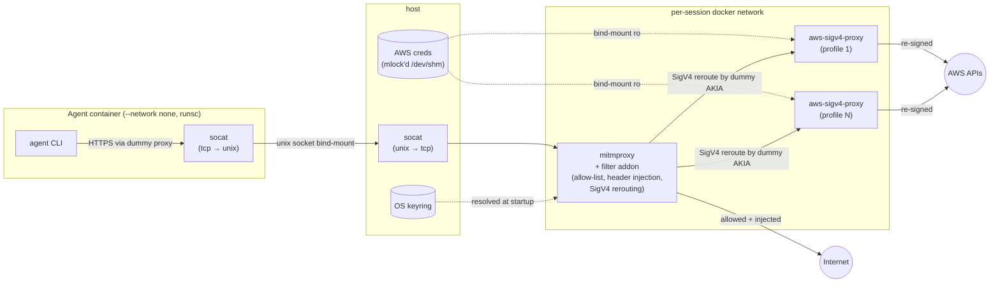

# agent-uplink

Run a coding agent in a hardened container with no direct network access. All outbound traffic is routed through a mitmproxy sidecar that enforces an allow-list and can inject credentials from your OS keyring, so secrets never enter the agent container.

Agent-agnostic by design: the orchestration (mitmproxy, AWS SigV4 sidecars, locked secrets, session cleanup) is generic, and each agent (currently just Claude) is a small subclass that owns its image, auth flow, and mount layout. Add a new agent by dropping a directory under `agent_uplink/agents/<name>/` — see [Adding an agent](#adding-an-agent).

AWS requests get the same treatment via SigV4 re-signing: the container holds only dummy AWS credentials, and mitmproxy reroutes signed AWS requests to an `aws-sigv4-proxy` sidecar (one per profile) that re-signs with the real keys kept on the host. See [AWS profiles](#aws-profiles).

**Linux only.** The design depends on gVisor (`runsc`), Linux paths (`/home/<user>/...`), and Unix-socket bind-mount semantics that Docker Desktop on macOS/Windows does not provide. WSL2 works.

## Architecture



## Install

```bash
pip install -e .
```

Requires `docker`, `socat`, and Python 3.10+ on `PATH`. `aws` CLI is needed only for `--aws-profiles`. Run from inside your home directory.

## Usage

`agent-uplink` takes a subcommand per agent. Today the only agent is `claude`; for it, one of `--anthropic` or `--bedrock` is required — it picks the provider env var injected into the container and the auth rule layered on top of the defaults.

```bash
agent-uplink claude --anthropic                                       # Anthropic API
agent-uplink claude --bedrock                                         # AWS Bedrock (bearer token)
agent-uplink claude --anthropic --rules examples/rules/atlassian.yaml # add rules on top of defaults
agent-uplink claude --anthropic --rules my.yaml --no-default-rules    # use only your rules (you must supply auth)
agent-uplink claude --bedrock --aws-profiles profile1 profile2        # also inject AWS credentials
agent-uplink claude --anthropic --force-rebuild                       # rebuild the agent image
```

Common flags (apply to any agent): `--aws-profiles`, `--mitmproxy-image`, `--sigv4-proxy-image`, `--force-rebuild`, `--rules`, `--no-default-rules`, `--runtime` (see [Runtime](#runtime)), `--debug`.

Per-agent flags for `claude`: `--image`, `--anthropic`/`--bedrock`.

State lives under `~/.agent_uplink/`; each run gets a session directory that is cleaned up on exit.

### Required secrets per claude mode

| Mode | Source | Populate with |
| --- | --- | --- |
| `--anthropic` | `~/.claude/.credentials.json` | `claude login` (the file's OAuth token is read on the host; the container only sees a fake placeholder) |
| `--bedrock` | service `bedrock`, user `key` in the host keyring | `keyring set bedrock key` (paste the value of `AWS_BEARER_TOKEN_BEDROCK`) |

Anthropic mode refreshes `~/.claude/.credentials.json` on the host when the OAuth token is near expiry, so runs survive across token rotations.

`--no-default-rules` skips the agent's auth rule too — for `--bedrock` you must supply your own in `--rules`. (`--anthropic` always wires up the OAuth-backed rule from the host's credentials file.)

## Runtime

The agent container defaults to `--runtime=runsc` ([gVisor](https://gvisor.dev/)) for a stronger isolation boundary than `runc`. Override with `--runtime runc` if gVisor isn't installed.

gVisor must be registered in `/etc/docker/daemon.json` with `--host-uds=all` so the container can reach the host-side Unix socket that bridges to mitmproxy:

```json
{
    "runtimes": {
        "runsc": {
            "path": "/usr/local/bin/runsc",
            "runtimeArgs": [
                "--network=host",
                "--host-uds=all"
            ]
        }
    }
}
```

Restart Docker after editing (`sudo systemctl restart docker`).

## Rules

Rules are YAML, evaluated in order; first match wins. Your rules are appended to the layered defaults unless `--no-default-rules` is passed.

The default stack (in order) is:
1. **Generic baseline** in `agent_uplink/default_rules.yaml` — allow `GET`/`OPTIONS`/`HEAD` to any host.
2. **Agent-specific defaults** in `agent_uplink/agents/<name>/default_rules.yaml` — e.g. for `claude`: Datadog logs, CHANGELOG, `downloads.claude.ai`.
3. **Agent auth rule** — agent-specific header injection (e.g. `claude --anthropic` adds `Authorization: Bearer <oauth>` for `api.anthropic.com`).
4. **Your `--rules` YAML** (always appended).

```yaml
rules:
  - name: my-rule
    host: '<regex>'             # required, matched with re.fullmatch
    methods: [GET, POST]        # optional, default = any
    paths: ['<regex>']          # optional, default = any
    inject:                     # optional
      headers:
        Authorization: 'Bearer {{keyring:my-service:my-user}}'
```

`{{keyring:SERVICE:USERNAME}}` placeholders are resolved on the host before any container starts; a failed lookup aborts startup. Store secrets with:

```bash
keyring set my-service my-user
```

On Linux/WSL2 this needs Secret Service (e.g. `gnome-keyring`) running, or the encrypted file backend from `keyrings.alt`.

See `examples/rules/atlassian.yaml` and `examples/rules/gitlab.yaml` for worked configurations.

## AWS profiles

`--aws-profiles foo bar` reads the named profiles from your host AWS config (`aws configure export-credentials`, with an `aws sso login` fallback). An agent may also contribute extra profiles via its `discover_aws_profiles()` hook (e.g. `claude --bedrock` picks up `env.AWS_PROFILE` from `~/.claude/settings.json`). For each profile:

- The container's `~/.aws/credentials` is populated with **dummy** values: a deterministic dummy access key per profile (`AKIA` + first 16 hex chars of `sha256(profile)`) and a fixed dummy secret. Real keys never enter the agent container.
- A small `aws-sigv4-proxy` sidecar is started on a per-session docker network. Real credentials are passed via a per-profile mlock'd `/dev/shm` file (`LockedSecret`, mode 0600) bind-mounted at `/aws/credentials`, with `AWS_SHARED_CREDENTIALS_FILE` pointing the SDK at it — never via `docker run -e ...`, since env vars are visible to any host user with docker access. The sidecar runs as the invoking user's uid/gid so it can read the host-owned file under `--cap-drop=ALL`.
- The mitmproxy addon detects `*.amazonaws.com` requests signed with `AWS4-HMAC-SHA256`, extracts the dummy AKIA from the `Credential=` field, strips the signature headers, and reroutes the request over plain HTTP to the matching sidecar — preserving the original `Host` so the sidecar signs for the right service/region before forwarding to AWS.

The agent container stays on `--network none`; sidecars live on a docker network it can't reach. STS credentials are exported once at startup, so long sessions may need a restart when they expire.

Requests to `*.amazonaws.com` with no matching SigV4 route return `403`. Unsigned requests (e.g. anonymous `GET` to a public S3 bucket) fall through to the normal allow-list.

`claude --bedrock` mode is a separate path: it injects a bearer token at the mitm layer (no AWS signing needed), so `--bedrock` doesn't require `--aws-profiles` unless you also want non-Bedrock AWS access.

## Adding an agent

1. Create `agent_uplink/agents/<name>/` containing:
   - `__init__.py` re-exporting your `Agent` subclass
   - `agent.py` subclassing `agent_uplink.agents.base.Agent` and implementing the lifecycle hooks (`add_cli_args`, `discover_aws_profiles`, `resolve_auth`, `write_session_files`, `auth_rules`, `build_mounts`, `container_env`)
   - `Dockerfile` and `entrypoint.sh` for the container image
   - `default_rules.yaml` for any agent-specific allow rules (optional)
2. Register the class in `agent_uplink/agents/__init__.py`'s `AGENTS` dict.
3. Add the package + its data files to `pyproject.toml`.

The CLI will pick up the new agent as a subcommand automatically.

## Security posture

Designed to contain rogue AI behaviour but is not a malware sandbox even with gvisor.

The root filesystem is read-only. A handful of paths are writable as ephemeral `tmpfs` (wiped on container exit, `noexec`, `nosuid`). For the Claude agent these are:

| Path in container | Size |
| --- | --- |
| `/tmp` | 200m |
| `~/.claude/` | 200m |
| `~/.local/share/applications/` | 200m |

These host paths are bind-mounted writable, because Claude state needs to persist across sessions:

| Path in container | Purpose |
| --- | --- |
| `<cwd>` | your project working directory |
| `~/.claude.json` | Claude global config |
| `~/.claude/projects/<project-id>/` | per-project history and state |
| `~/.claude/history.jsonl` | shell history (if present) |

Everything else under `~/.claude/` (`settings.json`, `CLAUDE.md`, `commands/`, `skills/`) and the mitmproxy CA are mounted read-only.
