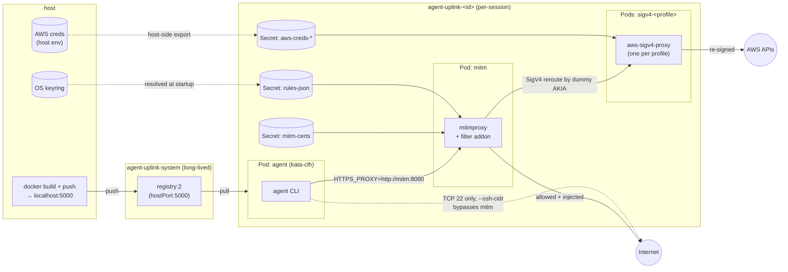

# agent-uplink

Run a coding agent in a Kata Containers microVM on a local k3s cluster with restricted network access. All^ outbound traffic is routed through a mitmproxy pod that enforces an allowlist and can inject credentials from your OS keyring, so secrets never enter the agent pod.

Agent-agnostic: orchestration is generic, each agent is a subclass under `agent_uplink/agents/<name>/`. Today only `claude` is implemented.

**Linux only** (WSL2 works). Tested against k3s.

## Architecture



## Install

```bash
pip install -e .
```

Requires `kubectl`, `docker`, Python 3.10+, and a k3s cluster with a kata RuntimeClass (`kubectl get runtimeclass`). `aws` CLI is needed for `--aws-profiles`. Run from inside your home directory.

On first run `agent-uplink` will print the one-time `/etc/rancher/k3s/registries.yaml` snippet needed so containerd can pull from the in-cluster registry at `localhost:5000`.

## Usage

```bash
agent-uplink claude --anthropic                                       # Anthropic API
agent-uplink claude --bedrock                                         # AWS Bedrock (bearer token)
agent-uplink claude --anthropic --rules examples/rules/atlassian.yaml
agent-uplink claude --bedrock --aws-profiles profile1 profile2
agent-uplink claude --anthropic --force-rebuild
agent-uplink claude --anthropic --rules examples/rules/ecr.yaml         # authenticated docker pulls (ECR)
agent-uplink claude --anthropic --ssh-cidr 10.0.0.0/24 --ssh-key-dir ~/keys/agent  # SSH egress
agent-uplink claude --anthropic --kube-context dev-cluster                          # k8s cluster access
agent-uplink claude --anthropic --kube-context ctx-a ctx-b --kubeconfig ~/.kube/extra.yaml
```

`--anthropic` reads `~/.claude/.credentials.json` (run `claude login` first). `--bedrock` reads `keyring get bedrock key`.

Each run creates a session namespace `agent-uplink-<id>`, torn down on exit.

### Authenticated docker pulls

`~/.docker/config.json` is never mounted into the pod. Private registry auth is handled the same way as everything else — a mitm rule injects the `Authorization` header on the registry host. The in-pod `dockerd` pulls anonymously; mitm adds the credential. `examples/rules/ecr.yaml` shows this for AWS ECR (Basic auth, token resolved on the host via `{{exec:...}}`, never entering the pod).

### SSH egress

By default the agent pod reaches only `mitm` and `kube-dns`, so SSH is blocked. Two flags open a controlled SSH path that **bypasses mitm** — SSH is not HTTP, so there is no allow-list, rule engine, or credential injection for it (a weaker trust model than the rest of agent-uplink):

- `--ssh-cidr <CIDR> [<CIDR> ...]` — allows **TCP 22 only** to those CIDRs (a bare IP becomes `/32`). This is the sole control on SSH egress, so scope it tightly. NetworkPolicy matches resolved IPs, not DNS names, so mind DNS/CDN churn for hosts like GitHub.
- `--ssh-key-dir <DIR>` — mounts a host directory of SSH private keys **read-only** at the agent user's `~/.ssh`. Read-only means `known_hosts` can't be persisted (pre-seed one in the dir to avoid prompts). The container user shares the host UID, so `0600` host-owned keys are readable.

The flags are independent but want each other (each logs a warning if used alone).

### Kubernetes cluster access

`--kube-context <ctx> [<ctx> ...]` exposes one or more host kubeconfig contexts to the agent. Unlike SSH egress, k8s traffic flows through mitm and is fully governed by the allow-list — no NetworkPolicy is modified.

For each context, agent-uplink reads the cluster CA, server URL, and credentials from the host kubeconfig (`kubectl config view --flatten --minify`), then:

- Produces a sanitized pod kubeconfig: real server URL, mitm CA for trust, real credentials stripped.
- Wires mitm to inject credentials on the upstream leg — bearer token as an `Authorization` header, or client certificate presented during TLS.
- Adds each cluster's serving CA to mitm's upstream trust store.

Real tokens and client keys never appear in the pod kubeconfig or the agent container.

**Supported auth methods:** static bearer token (`user.token` / `user.tokenFile`) and client certificate (`user.client-certificate-data` + `user.client-key-data`). `exec`/`auth-provider` contexts (EKS, GKE, AKS, OIDC) and `insecure-skip-tls-verify` are refused at startup with a clear error.

`--kubeconfig <path>` overrides the source file (default: `$KUBECONFIG` then `~/.kube/config`).

## Rules

YAML allow-list, first match wins. Match priority is by **layer**, not regex length: your rules first, then the agent's auth rule, then agent defaults, then the generic `GET`/`OPTIONS`/`HEAD`-anywhere catch-all last. `--no-default-rules` (or `replace_defaults: true`) keeps only your rules (and drops the auth rule).

```yaml
rules:
  - name: my-rule
    host: '<regex>'             # required
    methods: [GET, POST]        # optional
    paths: ['<regex>']          # optional
    inject:                     # optional
      headers:
        Authorization: 'Bearer {{keyring:my-service:my-user}}'
```

Header values support two placeholder forms, both resolved on the host before the mitm pod starts:

- `{{keyring:SERVICE:USERNAME}}` — static secret from the OS keyring (`keyring set my-service my-user`).
- `{{exec:COMMAND}}` — stdout (trailing newline stripped) of a host shell command, for short-lived dynamic credentials the keyring can't hold (e.g. an AWS CodeArtifact auth token). Off unless you pass `--allow-exec`.

See `examples/rules/`.

## Security

This is a fun side project that was nearly all written with claude, no guarantees about security are made. It's a local, single-user tool, and the agent is assumed cooperative. Known limitations of the egress control:

- Default rules allow `GET`/`OPTIONS`/`HEAD` to any host, so with defaults on, anything the agent can read can be exfiltrated via GET query strings/headers. For untrusted workloads, run `--no-default-rules` with an explicit allow-list.
- DNS to kube-dns is allowed (`^`) — a residual exfiltration channel the mitm allow-list never sees.
- `--allow-exec` lets a `--rules` file run host shell commands at startup - only enable it for rules files you trust.
- `--ssh-cidr` opens TCP 22 to the given CIDRs **bypassing mitm entirely** (no allow-list or rule engine for SSH) — scope the CIDRs tightly.
- For the `claude` agent, the host `~/.claude/settings.json` is currently copied into the pod **wholesale** (only the top-level `sandbox` key is dropped and `permissions` is replaced). Secret-bearing keys — `apiKeyHelper` and any secret `env` vars — therefore **do** reach the agent pod's `settings.json`, so keep secrets out of your host `settings.json`. An allow-list that drops these was intended but isn't implemented yet (tracked by an `xfail` test, `tests/unit/test_claude_config.py::test_settings_strips_secret_bearing_keys`).

^ NetworkPolicies can't restrict traffic for pod <-> host where the pod is scheduled.

## Testing

```bash
pip install -e ".[tests]"
pytest tests/unit          # fast, no cluster
pytest tests/integration   # live k3s; deploys namespaces/pods/policies
pytest tests               # everything
```

Unit tests need nothing. The integration suite runs against a live k3s cluster
(reusing the same `kubectl` + `docker` + `localhost:5000` registry setup the tool
itself needs) and focuses on the security posture: credentials never reaching the
agent pod, the agent's egress being confined to mitm + kube-dns, and the
allow-list / credential-injection / SigV4 reroute behaving as designed. **No real
credentials are needed** — every secret is a dummy or a sentinel. Pods run
privileged on the default runtime (no kata), so the suite runs on a bare k3s /
GitHub runner; `.github/workflows/integration-tests.yml` does exactly that. If no
cluster is reachable the integration suite skips itself. See
[`tests/README.md`](tests/README.md) for the design and the findings it surfaced.
