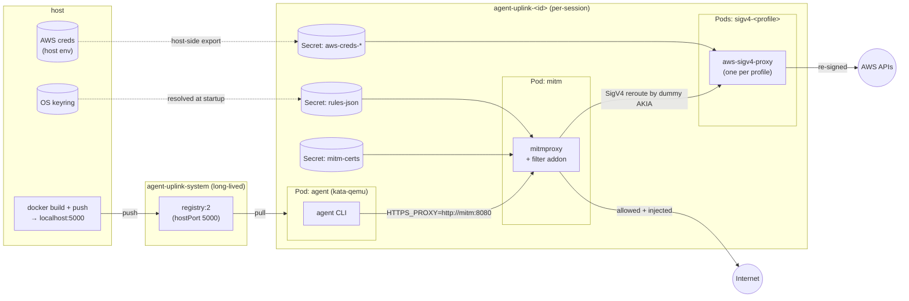

# agent-uplink

Run a coding agent in a Kata Containers microVM on a local k3s cluster with restricted network access. All^ outbound traffic is routed through a mitmproxy pod that enforces an allowlist and can inject credentials from your OS keyring, so secrets never enter the agent pod.

Agent-agnostic: orchestration is generic, each agent is a subclass under `agent_uplink/agents/<name>/`. Today only `claude` is implemented.

**Linux only** (WSL2 works). Tested against k3s.

## Architecture



## Install

```bash
pip install -e .
```

Requires `kubectl`, `docker`, Python 3.10+, and a k3s cluster with a kata RuntimeClass (`kubectl get runtimeclass`). `aws` CLI is needed for `--aws-profiles`. Run from inside your home directory.

On first run `agent-uplink` will print the one-time `/etc/rancher/k3s/registries.yaml` snippet needed so containerd can pull from the in-cluster registry at `localhost:5000`.

## Usage

```bash
agent-uplink claude --anthropic                                       # Anthropic API
agent-uplink claude --bedrock                                         # AWS Bedrock (bearer token)
agent-uplink claude --anthropic --rules examples/rules/atlassian.yaml
agent-uplink claude --bedrock --aws-profiles profile1 profile2
agent-uplink claude --anthropic --force-rebuild
```

`--anthropic` reads `~/.claude/.credentials.json` (run `claude login` first). `--bedrock` reads `keyring get bedrock key`.

Each run creates a session namespace `agent-uplink-<id>`, torn down on exit.

## Rules

YAML allow-list, evaluated in order, first match wins. Layered on top of generic + agent defaults unless `--no-default-rules` is passed.

```yaml
rules:
  - name: my-rule
    host: '<regex>'             # required
    methods: [GET, POST]        # optional
    paths: ['<regex>']          # optional
    inject:                     # optional
      headers:
        Authorization: 'Bearer {{keyring:my-service:my-user}}'
```

`{{keyring:SERVICE:USERNAME}}` is resolved on the host (`keyring set my-service my-user`). See `examples/rules/`.

## Security

This is a fun side project, no guarentees about security are made.

^ DNS is allowed and NetworkPolicies can't restrict traffic for pod <-> host where pod is scheduled.
