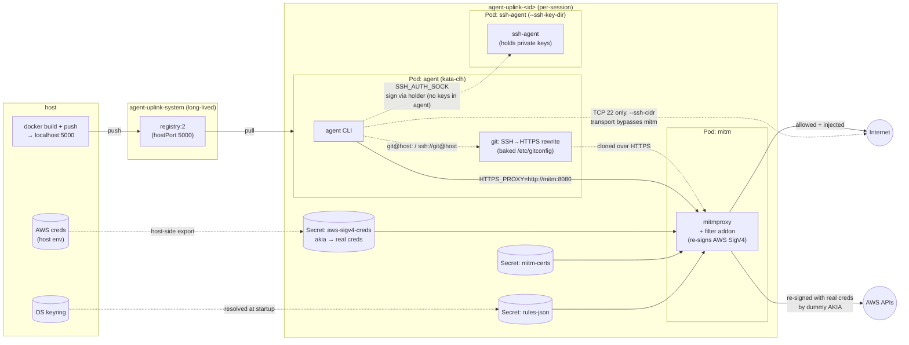

# agent-uplink

Run a coding agent in a Kata Containers microVM on a local k3s cluster with restricted network access. All^ outbound traffic
is routed through a mitmproxy pod that enforces an allowlist and can inject credentials from your OS keyring, so secrets never
enter the agent pod.

Agent-agnostic: orchestration is generic, each agent is a subclass under `agent_uplink/agents/<name>/`. Today only `claude` is implemented.

**Linux only** (WSL2 works). Tested against k3s.

## Architecture



## Install

### k3s prerequisites

```sh
# install k3s with local custom registry support
sudo mkdir -p /etc/rancher/k3s
sudo tee /etc/rancher/k3s/registries.yaml >/dev/null <<'EOF'
mirrors:
  "localhost:5000":
    endpoint:
      - "http://localhost:5000"
configs:
  "localhost:5000":
    tls:
      insecure_skip_verify: true
EOF
curl -sfL https://get.k3s.io | sh -

# install kata containers
export VERSION=$(curl -sSL https://api.github.com/repos/kata-containers/kata-containers/releases/latest | jq .tag_name | tr -d '"')
export CHART="oci://ghcr.io/kata-containers/kata-deploy-charts/kata-deploy"
helm install kata-deploy "${CHART}" --version "${VERSION}" -n kata-containers --create-namespace \
  --set k8sDistribution=k3s \
  --set shims.disableAll=true \
  --set shims.qemu.enabled=true \
  --set shims.clh.enabled=true

# Import the k3s context into ~/.kube/config as local-k8s-admin
sudo sed \
  -e '/server:/{n;s/^  name: default$/  name: local-k8s/}' \
  -e 's/^    cluster: default$/    cluster: local-k8s/' \
  -e 's/^    user: default$/    user: local-k8s-admin/' \
  -e 's/^  name: default$/  name: local-k8s-admin/' \
  -e 's/^- name: default$/- name: local-k8s-admin/' \
  -e 's/^current-context: default$/current-context: local-k8s-admin/' \
  /etc/rancher/k3s/k3s.yaml > /tmp/local-k8s.yaml
KUBECONFIG="$HOME/.kube/config:/tmp/local-k8s.yaml" kubectl config view --flatten > /tmp/kubeconfig.merged
install -m 600 /tmp/kubeconfig.merged "$HOME/.kube/config"
rm /tmp/local-k8s.yaml /tmp/kubeconfig.merged
```

### agent-uplink install

```bash
pip install agent-uplink
```

Requires `kubectl`, `docker`, and Python 3.10+. `aws` CLI is needed for `--aws-profiles`.

Run from inside your home directory.

agent-uplink deploys the session into the kubeconfig context named by `--deploy-context` (default `local-k8s-admin`; pass `''`
to use the current-context). This is the cluster it deploys *into*, distinct from `--kube-context`, which exposes clusters *to*
the agent.

## Usage

```bash
agent-uplink claude --anthropic                                       # Anthropic API
agent-uplink claude --bedrock                                         # AWS Bedrock (bearer token)
agent-uplink claude --anthropic --rules examples/rules/atlassian.yaml
agent-uplink claude --bedrock --aws-profiles profile1 profile2
agent-uplink claude --anthropic --force-rebuild
agent-uplink claude --anthropic --rules examples/rules/ecr.yaml         # authenticated docker pulls (ECR)
agent-uplink claude --anthropic --ssh-cidr 10.0.0.0/24 --ssh-key-dir ~/keys/agent  # SSH egress
agent-uplink claude --anthropic --rules examples/rules/git.yaml                     # git over HTTPS
agent-uplink claude --anthropic --git-https-rewrite git.example.com                 # rewrite an extra host
agent-uplink claude --anthropic --kube-context dev-cluster                          # k8s cluster access
agent-uplink claude --anthropic --kube-context ctx-a ctx-b --kubeconfig ~/.kube/extra.yaml
agent-uplink claude --anthropic --deploy-context my-cluster                         # cluster to deploy into
agent-uplink claude --anthropic --mount-rw ~/code/repo-b ~/code/repo-c             # mount extra repos (read-write)
agent-uplink claude --anthropic --mount-ro ~/.ansible.cfg                          # mount a host file read-only
agent-uplink claude --anthropic --maven                                            # opt-in: mount ~/.m2 + Maven proxy env
agent-uplink claude --anthropic --mitm-ca-cert ~/certs/corp-root.pem               # trust an extra upstream CA
agent-uplink claude --anthropic --mitm-insecure                                    # accept any upstream cert (no TLS verify)
agent-uplink claude --anthropic -- --resume <session-id>             # extra args forwarded to `claude`
agent-uplink claude --anthropic -- -p "summarise the build failure"
```

`--anthropic` reads `~/.claude/.credentials.json` (run `claude login` first). `--bedrock` reads `keyring get bedrock key`
(set it once with `keyring set bedrock key`).

Anything after a `--` separator is forwarded verbatim to the in-pod `claude` CLI (e.g. `--resume <id>`, `-c`, `-p
"<prompt>"`). The pod defaults to permission mode `auto`; `--allow-dangerously-skip-permissions` is always added so
`bypassPermissions` stays reachable via `Shift+Tab` (and on models without `auto` support, e.g. older Sonnet, where
the default falls back to `default` mode). Pass `--permission-mode` after `--` to override the default.

Each run creates a session namespace `agent-uplink-<id>`, torn down on exit.

### Configuration file

Every CLI flag can be set in a `.agent-uplink.yaml` file so you don't have to retype them. On an agent run, agent-uplink
reads every `.agent-uplink.yaml` from the working directory up to and including `~/.agent-uplink.yaml`, then applies the
CLI args on top. Precedence, lowest to highest:

```sh
~/.agent-uplink.yaml  <  ...  <  ./<project>/.agent-uplink.yaml  <  CLI args
```

So a home-level file holds your defaults, a project-level file overrides them, and an explicit CLI flag always wins. The
`list` / `clean` subcommands ignore config.

Keys are the flag's long name with or without dashes (`mount-rw` and `mount_rw` both work). Scalars and booleans follow
the precedence above (closer file wins, CLI wins over all). **Repeatable flags are additive** — values from every config
file and the CLI accumulate rather than replace:

```yaml
# ~/.agent-uplink.yaml — personal defaults for every project
anthropic: true                 # auth mode; or `bedrock: true`, or `auth_mode: anthropic`
debug: false
aws_profiles: [shared-readonly] # additive across files + CLI
mount_ro: [~/.ansible.cfg]
```

```yaml
# ./.agent-uplink.yaml — project overrides, layered on top of the home file
rules:
  - examples/rules/git.yaml     # a rules file (path), additive across files + CLI
  - name: jira                  # an inline rule, same schema as a rules file entry
    hosts: ['mycorp\.atlassian\.net']
    inject:
      headers:
        Authorization: 'Basic {{keyring:jira:me}}'
git_https_rewrite: [git.internal.example.com]
aws_profiles: [project-deploy]  # appended -> [shared-readonly, project-deploy]
kube_context: [dev-cluster]
```

`rules` is repeatable: list items are either file paths or inline rule mappings, concatenated in order (earlier entries
win first-match), so you can define rules inline without a separate file. `--rules a.yaml b.yaml` on the CLI behaves the
same way and appends after any config files.

With those two files, `agent-uplink claude` behaves as if you had passed every flag; `agent-uplink claude --bedrock -a extra`
switches the mode and appends `extra` to the AWS profiles. A worked example lives in
[`examples/agent-uplink.yaml`](examples/agent-uplink.yaml). Unknown keys or invalid values abort startup before any pod is
launched. (The passthrough args after `--` are the one exception to "additive": a CLI `-- ...` replaces a config
`claude_args:` rather than appending.)

### Managing sessions

Teardown rides on the run's signal handlers, so a `kill -9`, a host crash, or a closed laptop lid can leave a session namespace
(and its pods/microVM) behind. Two subcommands manage the leftovers — both operate on `--deploy-context` like a run does:

```bash
agent-uplink list                          # show session namespaces with status and age
agent-uplink clean <id> [<id> ...]         # delete specific sessions (id or full namespace)
agent-uplink clean --older-than 2h         # delete sessions older than a duration (s/m/h/d)
agent-uplink clean --all                   # delete every session namespace
agent-uplink clean --all --yes             # skip the confirmation prompt (for scripts)
```

`clean` lists what it will delete and prompts before acting (override with `-y`/`--yes`); pass `--wait` to block until each
namespace is gone. The long-lived registry namespace (`agent-uplink-system`) is never a target. A bare `clean` with no
selector is refused, so it can't wipe everything by accident.

### Authenticated docker pulls

`~/.docker/config.json` is never mounted into the pod. Private registry auth is handled the same way as everything else — a mitm
rule injects the `Authorization` header on the registry host. The in-pod `dockerd` pulls anonymously; mitm adds the credential.
`examples/rules/ecr.yaml` shows this for AWS ECR (Basic auth, token resolved on the host via `{{exec:...}}`, never entering the
pod).

### SSH egress

By default the agent pod reaches only `mitm` and `kube-dns`, so SSH is blocked. The SSH *transport* still **bypasses mitm** —
SSH is not HTTP, so there is no allow-list or rule engine for it; reachability is the only control. Two flags open it:

- `--ssh-cidr <CIDR> [<CIDR> ...]` — allows **TCP 22 only** to those CIDRs (a bare IP becomes `/32`). This is the sole control
  on which hosts SSH can reach, so scope it tightly. NetworkPolicy matches resolved IPs, not DNS names, so mind DNS/CDN churn
  for hosts like GitHub.
- `--ssh-key-dir <DIR>` — the **private keys never enter the agent pod**. They are loaded into an `ssh-agent` in a separate,
  hardened *holder* pod, and the agent reaches it over a socat bridge, so it can sign but never read the key bytes. (The holder
  is a separate pod because the privileged agent container could read a same-pod sidecar's memory.) The agent gets only the
  public keys + any `config`, placed in the standard `~/.ssh`; signing happens in the holder. Pin a key to a host with
  `IdentityFile ~/.ssh/<name>.pub` + `IdentitiesOnly yes`. Keys must be passphraseless (the holder loads them non-interactively).

This protects key **confidentiality** — a compromised agent can't steal the keys — but not authorization: the agent can still
use a key against any host the `--ssh-cidr` set allows, so that CIDR set remains the egress control. The flags are independent
but want each other (each logs a warning if used alone).

### Git over HTTPS

SSH egress is for shelling into machines, not git. Git runs over **HTTPS**, through mitm, so the allow-list governs it
and injects credentials host-side. The agent image bakes `insteadOf` rewrites for **github.com, gitlab.com,
bitbucket.org** that turn SSH remotes (`git@host:owner/repo`, `ssh://git@host/...`) into HTTPS at operation time, so
existing SSH remotes and submodules just work — `git clone git@github.com:owner/repo.git` becomes an HTTPS clone.

- `--git-https-rewrite <HOST> [<HOST> ...]` — rewrite extra hosts (e.g. self-hosted GitLab) too.
- `--no-git-identity` — by default the host's `user.name`/`user.email` are surfaced so commits are attributed; this
  omits them. The injected config carries no secrets and leaves the agent's `~/.gitconfig` writable.

Auth is **opt-in**: the default allow-list permits only `GET`/`OPTIONS`/`HEAD`, but git fetch/push POST to
`git-upload-pack`/`git-receive-pack`. Pass `--rules examples/rules/git.yaml` to allow those endpoints and inject HTTP
Basic auth (token resolved on the host, never entering the pod). Without it, even a public clone is denied.

### Extra mounts

By default the agent sees only the current working directory, mounted read-write at its host path. Two flags add more
host files or directories, each at its identical path — useful for cross-repo work or sharing a host config:

```bash
agent-uplink claude --anthropic --mount-rw ~/code/repo-b ~/code/repo-c   # extra repos, read-write
agent-uplink claude --anthropic --mount-ro ~/.ansible.cfg                # a host config, read-only
```

Constraints (startup is refused if any are violated):

- Each path must exist and be under `/home/<user>/`, the same rule the working directory follows.
- The same path can't be both `--mount-rw` and `--mount-ro`.
- A writable directory may not be an ancestor or descendant of the working directory or another writable directory at
  any depth. Siblings are fine; read-only mounts and files may sit anywhere (e.g. a read-only file inside a read-write
  repo). The `File`/`Directory` hostPath type is auto-detected.

The session still opens in the working directory (`cd "$WORKDIR"`); the extra paths are simply available alongside it.
There is no auto-mounting by file existence — every host integration (e.g. Maven via `--maven`) is explicit.

### Kubernetes cluster access

`--kube-context <ctx> [<ctx> ...]` exposes one or more host kubeconfig contexts to the agent. Unlike SSH egress, k8s traffic
flows through mitm and is fully governed by the allow-list — no NetworkPolicy is modified.

For each context, agent-uplink reads the cluster CA, server URL, and credentials from the host kubeconfig (`kubectl config view
--flatten --minify`), then:

- Produces a sanitized pod kubeconfig: real server URL, mitm CA for trust, real credentials stripped.
- Wires mitm to inject credentials on the upstream leg — bearer token as an `Authorization` header, or client certificate
  presented during TLS.
- Adds each cluster's serving CA to mitm's upstream trust store.

Real tokens and client keys never appear in the pod kubeconfig or the agent container.

**Supported auth methods:** static bearer token (`user.token` / `user.tokenFile`) and client certificate
(`user.client-certificate-data` + `user.client-key-data`). `exec`/`auth-provider` contexts (EKS, GKE, AKS, OIDC) and
`insecure-skip-tls-verify` are refused at startup with a clear error.

`--kubeconfig <path>` overrides the source file (default: `$KUBECONFIG` then `~/.kube/config`).

### Upstream TLS trust

mitmproxy verifies upstream certificates against its built-in roots (the image's `certifi` bundle). Two flags adjust that
for upstreams those roots don't cover (a corporate proxy, an internal service with a private CA):

- `--mitm-ca-cert <file> [<file> ...]` trusts extra CA(s) **on top of** the defaults. Each file is PEM-encoded and may hold
  multiple concatenated certs; the flag is repeatable. mitmproxy's trust option *replaces* rather than augments its store,
  so agent-uplink concatenates the default roots, any kube cluster CAs, and your CA(s) into one bundle the mitm pod trusts.
  Prefer this over `--mitm-insecure`.
- `--mitm-insecure` disables upstream certificate verification entirely (`ssl_insecure`). It accepts any cert, including
  self-signed, and **removes protection against an upstream MITM** — use only as a last resort. Off by default.

## Rules

YAML allow-list, first match wins. Match priority is by **layer**, not regex length: the agent's auth rule (and any kube
rules) first, then your rules, then agent defaults, then the generic `GET`/`OPTIONS`/`HEAD`-anywhere catch-all last. Auth
and kube rules lead so a broad rule of yours on an overlapping host (e.g. `.*\.amazonaws\.com`) can't shadow an injected
credential. `--no-default-rules` (or `replace_defaults: true` in any rules file) keeps only your rules (and drops the auth
rule).

`--rules` is repeatable (`--rules a.yaml b.yaml`); files are concatenated in order, an earlier file winning first-match
over a later one. Rules can also be defined inline in `.agent-uplink.yaml` under the same `rules:` key (file paths and
inline rule mappings can be mixed in one list) — see [Configuration file](#configuration-file).

```yaml
rules:
  - name: my-rule
    hosts: ['<regex>']          # required; list of host regexes (any match)
    methods: [GET, POST]        # optional
    paths: ['<regex>']          # optional
    inject:                     # optional
      headers:
        Authorization: 'Bearer {{keyring:my-service:my-user}}'
```

Header values support two placeholder forms, both resolved on the host before the mitm pod starts:

- `{{keyring:SERVICE:USERNAME}}` — static secret from the OS keyring (`keyring set my-service my-user`).
- `{{exec:COMMAND}}` — stdout (trailing newline stripped) of a host shell command, for short-lived dynamic credentials the
  keyring can't hold (e.g. an AWS CodeArtifact auth token). Off unless you pass `--allow-exec`.

### Raw TCP passthrough (mTLS)

mitm normally terminates TLS, which makes upstream mutual TLS impossible — the agent's client cert is consumed by mitm and
never reaches the server. An `l4_forward` rule instead tunnels a matched connection as raw TCP so the agent's TLS (incl. a
`curl --cert/--key` client cert) runs end-to-end:

```yaml
rules:
  - name: corp-mtls
    l4_forward: true
    hosts: ['secure\.corp\.example\.com']   # matched only when the target is a hostname
    cidrs: ['192.168.149.0/24']             # matched only when the target is a literal IP in the request
```

Matching is on the CONNECT target before DNS resolution; `hosts` matches hostnames, `cidrs` matches literal-IP requests (a
hostname that resolves into the range is not matched). Such connections **bypass the allow-list and injection** — mitm can't
see inside the tunnel — so scope them narrowly. See `docs/rules.md` and `examples/rules/l4-passthrough.yaml`.

See `examples/rules/`.

## Security

This is a fun side project that was nearly all written with claude, no guarantees about security are made. It's a local,
single-user tool, and is not a malware sandbox. Known limitations/tradeoffs of the egress control:

- Default rules allow `GET`/`OPTIONS`/`HEAD` to any host, so with defaults on, anything the agent can read can be exfiltrated
  via GET query strings/headers. For untrusted workloads, run `--no-default-rules` with an explicit allow-list.
- DNS to kube-dns is allowed (`^`) — a residual exfiltration channel the mitm allow-list never sees.
- `--allow-exec` lets a `--rules` file run host shell commands at startup - only enable it for rules files you trust.
- `--ssh-cidr` opens TCP 22 to the given CIDRs **bypassing mitm entirely** (no allow-list or rule engine for the SSH transport)
  — scope the CIDRs tightly. With `--ssh-key-dir` the private keys stay in a separate holder pod and never enter the agent (it
  signs via an ssh-agent bridge), so the keys can't be stolen, but they can still be used against any host the CIDRs allow.
- For the `claude` agent, the host `~/.claude/settings.json` is currently copied into the pod **wholesale** (only the top-level
  `sandbox` key is dropped and `permissions` is replaced). Secret-bearing keys — `apiKeyHelper` and any secret `env` vars —
  therefore **do** reach the agent pod's `settings.json`, so keep secrets out of your host `settings.json`.

^ NetworkPolicies can't restrict traffic for pod <-> host where the pod is scheduled.

## Testing

```bash
pip install -e ".[tests]"
pytest tests/unit          # fast, no cluster
pytest tests/integration   # live k3s; deploys namespaces/pods/policies
pytest tests               # everything
```

Unit tests need nothing. The integration suite runs against a live k3s cluster
(reusing the same `kubectl` + `docker` + `localhost:5000` registry setup the tool
itself needs) and focuses on the security posture: credentials never reaching the
agent pod, the agent's egress being confined to mitm + kube-dns, and the
allow-list / credential-injection / SigV4 re-signing behaving as designed. **No real
credentials are needed** — every secret is a dummy or a sentinel. Pods run
privileged on the default runtime (no kata), so the suite runs on a bare k3s /
GitHub runner; `.github/workflows/integration-tests.yml` does exactly that. If no
cluster is reachable the integration suite skips itself. See
[`tests/README.md`](tests/README.md) for the design and the findings it surfaced.
